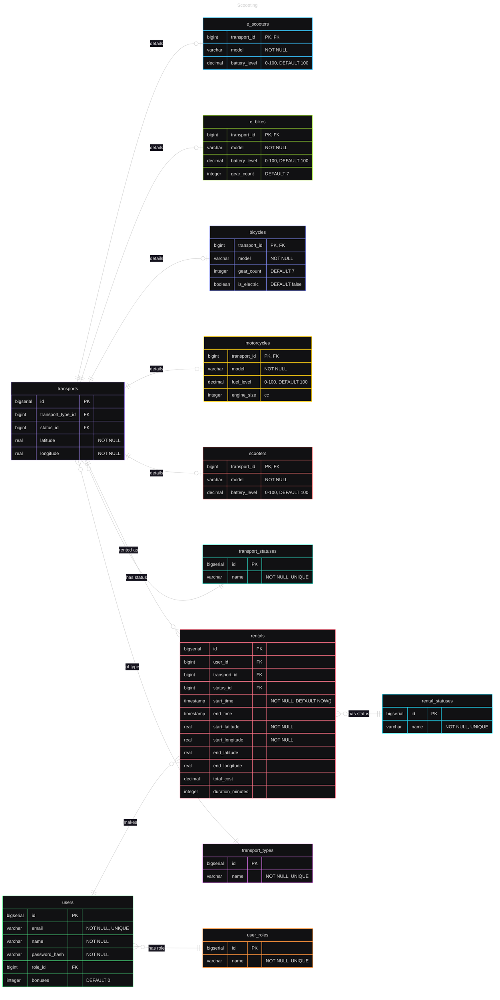

# Scoooting #
### Проект по дисциплине "Высокопроизводительные системы". ###
### Аренда электросамокатов. ###

---
После клонирования репозитория ввести команду:
```
docker compose up --build -d
```

## MVP database architecture



#### or a pic if mermaid doesn't work:


