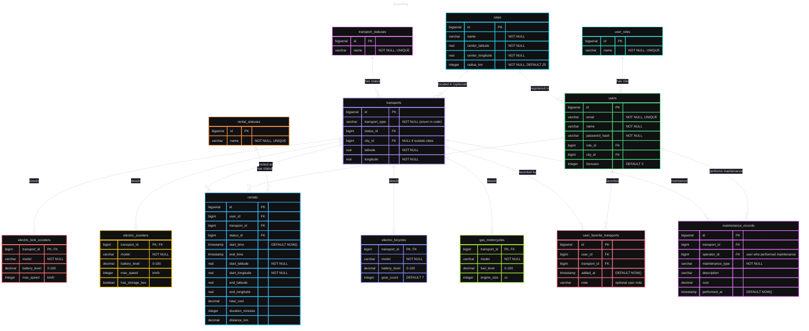

# Scoooting #
### Проект по дисциплине "Высокопроизводительные системы". ###
### Аренда электросамокатов. ###

---
После клонирования репозитория ввести команду (сейчас не работает):
```
docker compose up --build -d
```

## Тестирование

Для запуска тестов следует предварительно собрать образы всех микросервисов

## MVP database architecture



#### or a pic if mermaid doesn't work:

||
|-|

## Circuit Breaker

### FSM

||
|-|

### Demo

|1. CLOSED -> OPEN ||
|-|-|
|**2. OPEN -> HALF_OPEN**||
|**3. HALF_OPEN -> CLOSED**||


